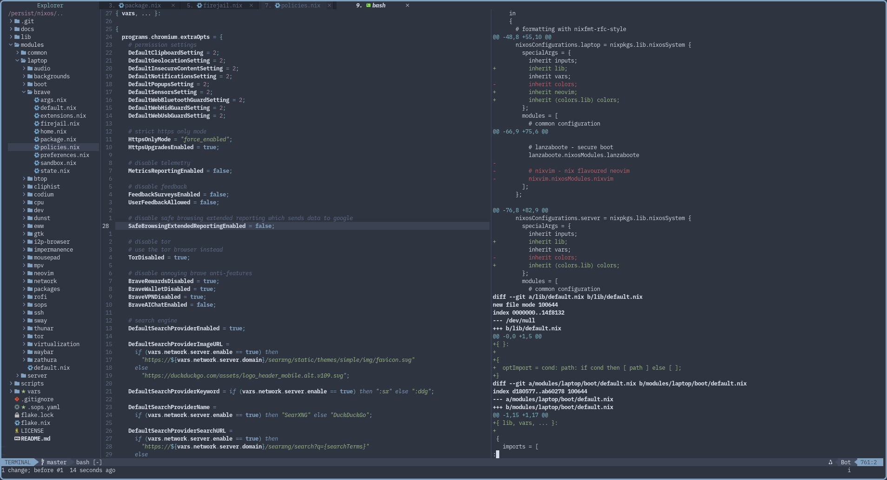

# Neovim Configuration Flake

Neovim configuration flake (ft. nixvim).



# Features

|                            |                                          |
|----------------------------|------------------------------------------|
| Highlights                 | `treesitter`                             |
| Buffers                    | `bufferline`                             |
| Explorer                   | `nvim-tree`                              |
| Find                       | `telescope`                              |
| Icons                      | `web-devicons`                           |
| Colorscheme                | `nord`                                   |
| Languages                  | `nix` `python` `rust` `go`               |
| Completions                | `nvim-cmp`                               |

# Usage

```console
$ nix run github:sotormd/neovim
```

For use in another flake, add this to your inputs:
- `neovim.url = "github:sotormd/neovim";`

This provides the following packages:
- `neovim.packages.x86_64-linux.default`
- `neovim.packages.aarch64-linux.default`
